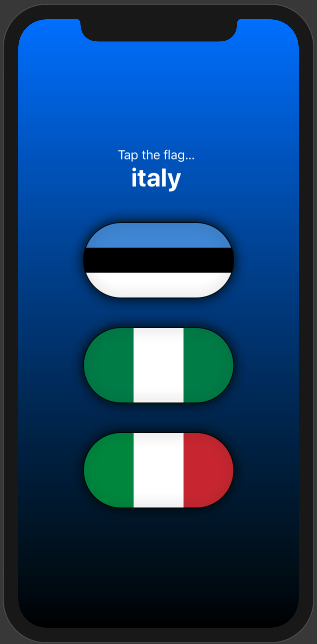
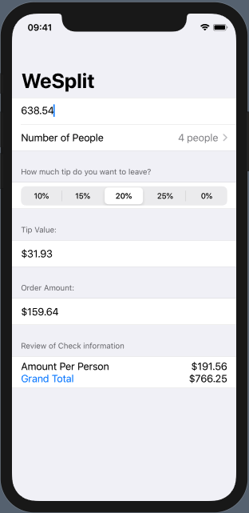
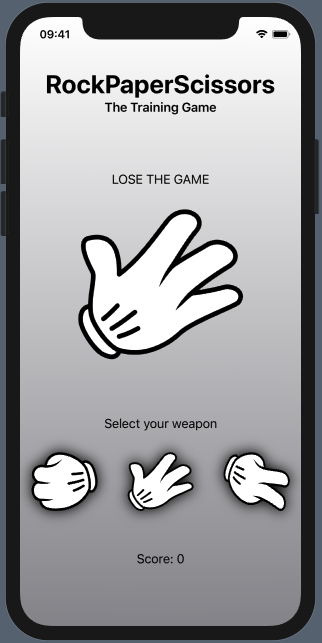
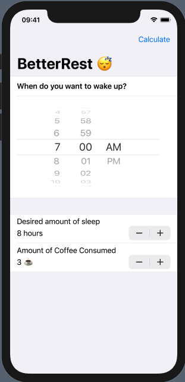
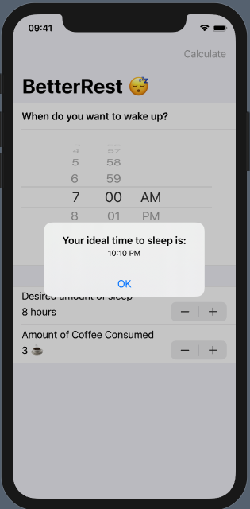
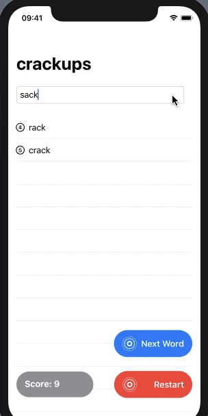

# 100DaysOfSwiftUI

In efforts to have some fun during the quarantine, this repo will be tracking my progress within Hacking with Swift's [100 days of SwiftUI challenge.](https://www.hackingwithswift.com/100/swiftui) 

## 100 Days Tracker

* [x] Days 1 - 12: Introduction to Swift 
* [x] Days 13 - 15: Consolidation I
* [x] Days 16 - 24: Starting SwiftUI
* [x] Day 25: Consolidation II
* [ ] Days 26 - 34: Expanding Your Skills
* [ ] Day 35: Consolidation III
* [ ] Days 36 - 46: Scaling Up to Bigger Apps
* [ ] Days 47 - 48: Consolidation IV
* [ ] Days 49 - 59: Focus on Data
* [ ] Days 60 - 61: Consolidation V
* [ ] Days 62 - 76: Views and View Controllers
* [ ] Days 77 - 78: Consolidation VI
* [ ] Days 79 - 94: Controlling UI Flow
* [ ] Day 95: Consolidation VII
* [ ] Days 96 - 99: One Last Project
* [ ] Day 100: Final

## Project Catalog:

###  Guess The Flag

Single view application, prompts user to associate image of a flag based off of country name provided.

###  WeSplit

Single view application which provides end user dynamic tip splitter for 2-10 users. 

### RockPaperScissor Trainer

Single view application : trains user to enhance their Rock Paper Scissor skills by selecting the right or wrong move based on the on screen prompt. 

### BetterRest 

FormBased application implementing Core ML to optimize coffee drinkers sleep quality 

Implements regression analysis to present optimal sleep time based on how much coffee user has consumed. 

### WordSplitter 

Word splitting game - requires  user to derive novel words from a word presented randomly. Leverages UITextChecker to validate word exists in English language, counts users successful inputs by word count. 

 
